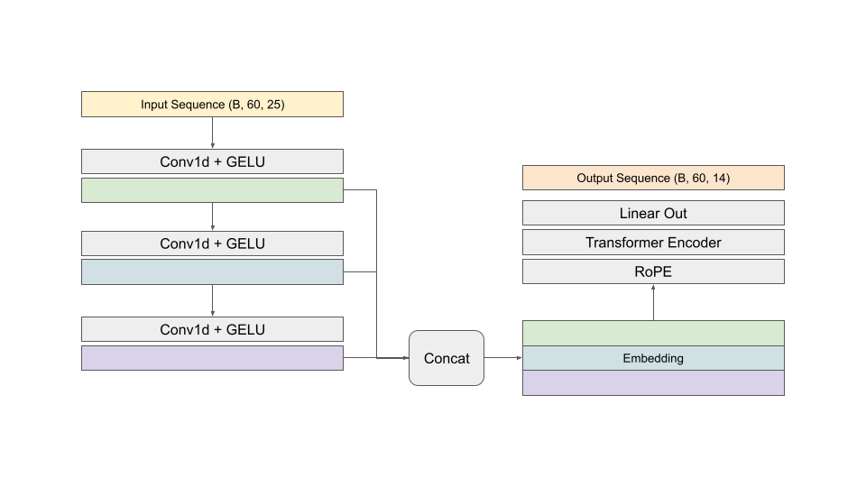
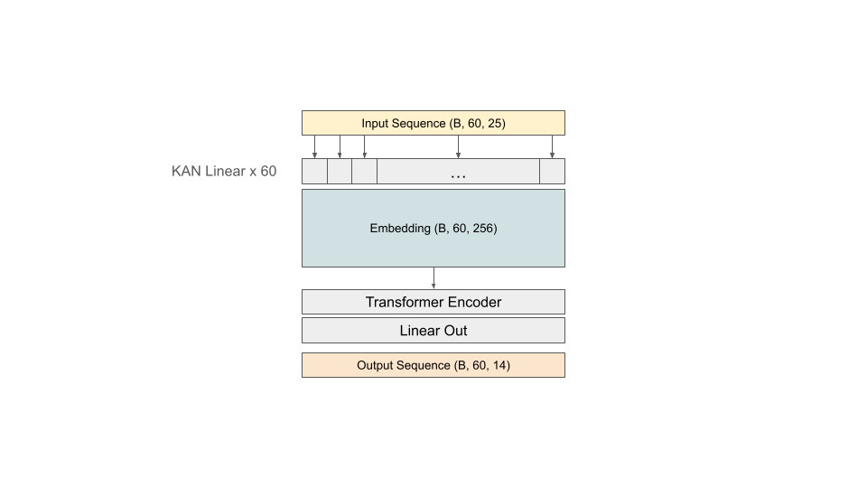

# LEAP - Atmospheric Physics using AI (ClimSim) Kaggle Competition Solution

Our solution utilizes the PyTorch Lightning framework for training. All model architectures are based on the transformer encoder. Rotary positional encoding proved effective. Data preparation involved normalization, log transformation, min-max scaling, and clamping. Post-processing employed a column-wise ensemble method. While KAN linear embedding did not improve the score, it contributed as one of the models in the ensemble. We used 90% of the data for training and the remaining 10% for validation.

## Context
* Bussiness context: <https://www.kaggle.com/competitions/leap-atmospheric-physics-ai-climsim/overview>
* Data context: <https://www.kaggle.com/competitions/leap-atmospheric-physics-ai-climsim/data>

## Training - Pytorch Lightning Framework

Our solution provides a convenient and neat approach for training machine learning models using the `PTLit` (PyTorch Lightning module) class. The training and validation loops are fully encapsulated within the class, simplifying the process. When multiple models are used, the class automatically averages their outputs to create an ensemble.

* To train a specific model:
``` python
mdlit = PTLit(mask, learning_rate, step_size, gamma, [YOUR_MODEL()])
```
* To train multiple models as an ensemble:
``` python
mdlit = PTLit(mask, learning_rate, step_size, gamma, [YOUR_1ST_MODEL(), YOUR_2ND_MODEL()])
```
* To load models from checkpoints and train them as an ensemble:
``` python
base_models = PTLit.load_from_checkpoint("PATH_TO_THE_1ST_SAVED_CHECKPOINT").models
base_models += PTLit.load_from_checkpoint("PATH_TO_THE_2ND_SAVED_CHECKPOINT").models
mdlit = PTLit(mask, learning_rate, step_size, gamma, base_models)
```

## Models
### Rotary positional encoding

In our experiment, switching from the original positional encoding to [Rotary positional encoding (RoPE)](https://arxiv.org/abs/2104.09864) resulted in an improvement of approximately 0.005 in the public score. Our best single model combined RoPE with a basic transformer encoder, achieving a score of 0.751 on the public leaderboard and 0.744 on the private leaderboard.

### Model Architectures - What we also tried

<p align="center">
    
</p>

Our JNet model architecture processes the input sequence of shape (B, 60, 25) through a series of Conv1d layers, each followed by GELU activation functions, to extract hierarchical features. The outputs of these layers are concatenated into a combined feature representation, an embedding. This embedding is enriched with Rotary Positional Encoding (RoPE) to provide positional information and is subsequently processed by a transformer encoder. Finally, a linear layer generates the output sequence of shape (B, 60, 14). 

<p align="center">
    
</p>

Our KANformer model architecture begins with an input sequence of shape (B, 60, 25) and applies a series of 60 [KAN](https://arxiv.org/abs/2404.19756) linear layers (25, 256) to each token of the sequence. These layers transform the input into an embedding of shape (B, 60, 256). This embedding is then processed by a transformer encoder to capture dependencies within the sequence. Finally, a linear layer generates the output sequence of shape (B, 60, 14). While KAN linear embedding did not improve the score, it contributed as one of the models in the ensemble.

## Data Preprocessing

Without domain knowledge, we analyzed the distribution histograms of all feature columns one by one to determine the need for log transformation to address skewness. Afterward, we manually decided whether to apply normalization or min-max scaling to each feature column.

For the label columns, direct normalization caused extreme values for the minimum and maximum. To mitigate this, we first clamped the label columns and then applied normalization. While clamping made it easier for the model to learn initially, it did not result in a better score after convergence. However, this approach can still be useful for curriculum learning. We included models trained on clamped data as part of the ensemble in the final submission.

## Data Postprocessing - Column-wise Ensemble
We used `optuna` to search for the best weights to ensemble models for each column. The code is as follows:

```python
num_targets = label.size(1)
preds_em = torch.zeros_like(preds[0])
alphas = torch.zeros(num_targets, num_models)

def objective(trial, i):
    weights = []
    remaining_sum = 10
    for j in range(num_models - 1):
        w_i = trial.suggest_float(f'weight_{j}', 0, remaining_sum, step=.5)
        w = w_i / 10.
        weights.append(w)
        remaining_sum -= w_i
    col = sum(weight * preds[m][:, i] for m, weight in enumerate(weights))
    return r2_score(col, labeln[:, i])

for i in tqdm(range(num_targets)):
    if mask[i]:
        study = optuna.create_study(direction='maximize')
        study.optimize(lambda trial: objective(trial, i), n_trials=50)
        best_weights = []
        remaining_sum = 10.0
        for j in range(num_models - 1):
            w = study.best_params[f'weight_{j}']
            best_weights.append(w / 10.)
            remaining_sum -= w
        best_weights.append(remaining_sum / 10.) 
        alphas[i] = torch.tensor(best_weights)
        preds_em[:, i] = sum(weight * preds[m][:, i] for m, weight in enumerate(best_weights))
```

## References

@article{liu2024kan,
  title={KAN: Kolmogorov-Arnold Networks},
  author={Liu, Ziming and Wang, Yixuan and Vaidya, Sachin and Ruehle, Fabian and Halverson, James and Solja{\v{c}}i{\'c}, Marin and Hou, Thomas Y and Tegmark, Max},
  journal={arXiv preprint arXiv:2404.19756},
  year={2024}
}

@misc{su2021roformer,
    title   = {RoFormer: Enhanced Transformer with Rotary Position Embedding}, 
    author  = {Jianlin Su and Yu Lu and Shengfeng Pan and Bo Wen and Yunfeng Liu},
    year    = {2021},
    eprint  = {2104.09864},
    archivePrefix = {arXiv},
    primaryClass = {cs.CL}
}
